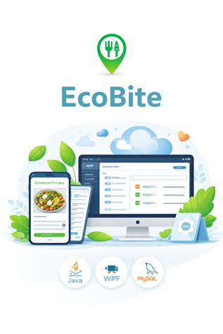
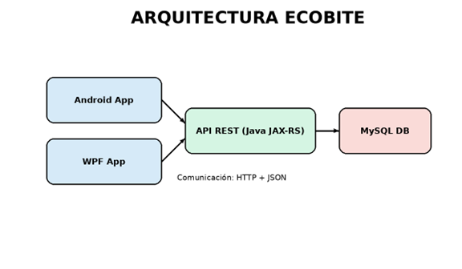
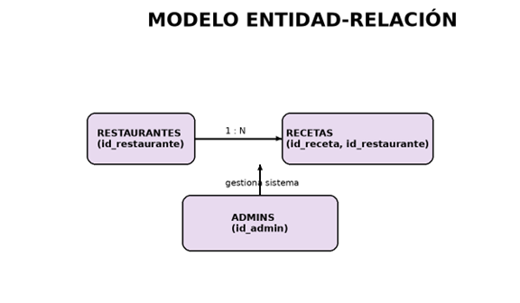
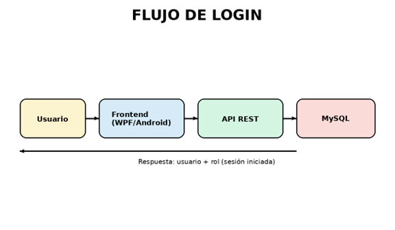

# EcoBite

## Memoria Técnica – Proyecto Final DAM

  

**Proyecto:** EcoBite  

 

**Alumnos**

Nazir Cheikh Moussa  

Alejandro Ramos Pastor

Franco Ezequiel Gonzalez Quintana

José Ángel Gómez Torres

 

**Ciclo:** Desarrollo de Aplicaciones Multiplataforma  

**Centro:** IES Doctor Balmis  

**Curso:** 2º DAM  

    

---

# Contenido

1. [Introducción](#1-introducción)
2. [Justificación y ODS](#2-justificación-y-ods)
3. [Objetivos](#3-objetivos)
4. [Arquitectura del sistema](#4-arquitectura-del-sistema)
5. [Base de datos](#5-base-de-datos)
6. [Backend API REST](#6-backend-api-rest)
7. [Frontend WPF](#7-frontend-wpf)
8. [Aplicación Android](#8-aplicación-android)
9. [Gestión de imágenes](#9-gestión-de-imágenes)
10. [Seguridad y validaciones](#10-seguridad-y-validaciones)
11. [Problemas y soluciones](#11-problemas-y-soluciones)
12. [Pruebas](#12-pruebas)
13. [Estado actual](#13-estado-actual)
14. [Mejoras futuras](#14-mejoras-futuras)
15. [Competencias adquiridas](#15-competencias-adquiridas)
16. [Conclusión](#16-conclusión)

---

# 1. Introducción

EcoBite es una solución multiplataforma orientada a la gestión de contenido relacionado con la alimentación saludable, diseñada como proyecto final del ciclo formativo de Desarrollo de Aplicaciones Multiplataforma (DAM).

El objetivo principal del sistema es ofrecer una herramienta digital que permita centralizar información sobre restaurantes y recetas saludables, facilitando su acceso de forma sencilla, intuitiva y estructurada.

El sistema ha sido concebido para responder a una necesidad actual: la creciente preocupación por la salud, la alimentación equilibrada y el consumo responsable.

En este contexto, EcoBite actúa como intermediario entre restaurantes que ofrecen opciones saludables y usuarios interesados en este contenido.

Desde el punto de vista técnico, EcoBite utiliza una arquitectura cliente-servidor:

- Aplicación escritorio WPF
- Aplicación Android
- API REST
- Base de datos relacional

Funcionalidades principales:

- Registro de restaurantes
- Autenticación usuarios
- Gestión recetas
- Navegación restaurante-receta
- Persistencia relacional

Este enfoque permite una solución escalable y preparada para futuras ampliaciones.

---

# 2. Justificación y ODS

EcoBite responde no solo a una finalidad académica sino también social, promoviendo hábitos saludables y sostenibles.

El proyecto se alinea con:

## ODS 3 – Salud y bienestar

EcoBite promueve:

- Alimentación equilibrada
- Difusión recetas saludables
- Restaurantes nutritivos
- Mejora hábitos alimenticios

## ODS 12 – Producción y consumo responsables

El sistema impulsa:

- Consumo responsable
- Transparencia alimentaria
- Opciones sostenibles
- Restaurantes comprometidos

EcoBite busca generar impacto positivo tanto tecnológico como social.

---

# 3. Objetivos

## Objetivo general

Desarrollar una aplicación cliente-servidor para gestionar recetas saludables asociadas a restaurantes.

El objetivo principal del proyecto es el desarrollo de una aplicación completa basada en una arquitectura cliente-servidor que permita gestionar recetas saludables asociadas a restaurantes.
Para alcanzar este objetivo general, se han definido una serie de objetivos específicos:
En primer lugar, se ha planteado el diseño e implementación de una API REST funcional que permita la comunicación entre los distintos clientes y el sistema central. Esta API debe ser capaz de gestionar correctamente las peticiones, procesar la lógica de negocio y devolver respuestas en formato JSON.
Además, se ha desarrollado una aplicación de escritorio utilizando WPF y el patrón MVVM, con el objetivo de crear una interfaz estructurada, mantenible y desacoplada de la lógica de negocio.
Por otro lado, se ha implementado una aplicación Android utilizando Kotlin y Jetpack Compose, aplicando también el patrón MVVM y las buenas prácticas actuales del desarrollo móvil.
Otro objetivo clave ha sido la correcta gestión de datos, incluyendo la persistencia en base de datos relacional, el manejo de imágenes y la validación de la información introducida por el usuario.
Finalmente, se ha buscado implementar un sistema básico de autenticación y control de roles, diferenciando entre administradores 

## Objetivos específicos

- Implementar una API REST funcional
- Desarrollar aplicación WPF mediante MVVM
- Desarrollar aplicación Android con Kotlin y Compose
- Gestionar persistencia de datos
- Gestionar imágenes
- Implementar autenticación y roles
- Preparar futuras mejoras de seguridad

---

# 4. Arquitectura del sistema

EcoBite utiliza arquitectura cliente-servidor multicapa.

El sistema EcoBite se basa en una arquitectura cliente-servidor de tres capas, lo que permite separar claramente las responsabilidades de cada componente y facilita la escalabilidad del sistema.
En la capa de presentación se encuentran los clientes, que en este caso son dos: la aplicación de escritorio desarrollada en WPF y la aplicación móvil desarrollada para Android. Ambos clientes son responsables de la interacción con el usuario, mostrando la información y recogiendo los datos introducidos.
La capa intermedia corresponde al backend, implementado como una API REST en Java. Esta capa actúa como intermediario entre los clientes y la base de datos, encargándose de procesar las peticiones, aplicar la lógica de negocio y garantizar la coherencia de los datos.
Finalmente, en la capa de datos se encuentra la base de datos MySQL, donde se almacena toda la información del sistema de forma estructurada.
La comunicación entre capas se realiza mediante el protocolo HTTP utilizando JSON como formato de intercambio de datos. Esta elección permite una alta compatibilidad entre plataformas y facilita la integración futura con otros sistemas.

    

El sistema se basa en una arquitectura cliente-servidor donde los frontends (WPF y Android) consumen una API REST desarrollada en Java, que gestiona la lógica de negocio y el acceso a la base de datos MySQL mediante JSON sobre HTTP.

Usuario

↓

Aplicación Escritorio (WPF)

↓

Aplicación Android (Kotlin)

↓

API REST

↓

Base de datos MySQL

La comunicación utiliza:

- HTTP
- JSON

Los clientes consumen una API REST desarrollada en Java.

## Arquitectura interna

Views

↓

ViewModels

↓

Services

↓

API REST

↓

MySQL

### Descripción capas

### Views

Interfaz mostrada al usuario.

Tecnologías:

- WPF → XAML
- Android → Compose

### ViewModels

Responsables de:

- Estado UI
- Navegación
- Validaciones
- Comunicación servicios

### Services

Gestionan:

- Peticiones REST
- Acceso backend
- Transformación datos

---

# 5. Base de datos

La base de datos del sistema utiliza un modelo relacional MySQL denominado:

**ecobite**

La base de datos del sistema ha sido diseñada siguiendo un modelo relacional, aplicando principios de normalización con el objetivo de evitar redundancias y garantizar la integridad de los datos.
El modelo se compone de tres entidades principales: administradores, restaurantes y recetas.
La entidad de administradores se encarga de representar a los usuarios con privilegios elevados dentro del sistema, responsables de la gestión global de la plataforma.
La entidad de restaurantes representa los negocios registrados en EcoBite. Cada restaurante puede introducir sus propios datos, incluyendo información de contacto, descripción y contenido relacionado.
Por último, la entidad de recetas constituye el núcleo del sistema, ya que representa el contenido principal que será consultado por los usuarios. Cada receta está asociada a un restaurante mediante una relación de tipo uno a muchos.
Desde el punto de vista de integridad, se han implementado claves primarias para identificar de forma única cada registro, claves foráneas para establecer relaciones entre tablas, y restricciones como NOT NULL y UNIQUE para garantizar la validez de los datos.
Este diseño permite realizar consultas eficientes, facilita la escalabilidad del sistema y asegura la coherencia de la información almacenada.

    

El modelo relacional establece una relación 1:N entre restaurantes y recetas, permitiendo que cada restaurante gestione múltiples recetas, mientras que los administradores controlan el sistema.

El diseño se basa en relaciones normalizadas evitando redundancias y garantizando integridad.

## Tabla usuarios

| Campo | Tipo |
|---|---|
| id_usuario | INT PK |
| nombre | VARCHAR |
| apellidos | VARCHAR |
| telefono | VARCHAR |
| email | VARCHAR |
| password | VARCHAR |
| rol | VARCHAR |

---

## Tabla restaurantes

| Campo | Tipo |
|---|---|
| id_restaurante | INT PK |
| nombre | VARCHAR |
| descripcion | TEXT |
| imagen | VARCHAR |
| ubicacion | VARCHAR |
| horario | VARCHAR |

---

## Tabla recetas

| Campo | Tipo |
|---|---|
| id_receta | INT PK |
| nombre | VARCHAR |
| descripcion | TEXT |
| pasos | TEXT |
| calorias_totales | INT |
| imagen | VARCHAR |
| id_restaurante | FK |

### Relación principal

Restaurante (1)

↓

Recetas (N)

El modelo facilita integridad y escalabilidad.

---

# 6. Backend (API REST)

El backend constituye el núcleo del sistema EcoBite, siendo el responsable de gestionar toda la lógica de negocio y la interacción con la base de datos.

Se ha desarrollado utilizando Java junto con JAX-RS para la creación de servicios REST y JPA para la persistencia de datos. Esta combinación permite implementar una arquitectura robusta y escalable.

El backend recibe peticiones HTTP desde los clientes, procesa los datos recibidos y devuelve respuestas en formato JSON. Este flujo permite una comunicación eficiente y estandarizada entre los distintos componentes del sistema.

Uno de los aspectos clave del desarrollo ha sido el uso de DTOs (Data Transfer Objects) o estructuras como HashMap para evitar problemas derivados de la serialización automática de entidades JPA. Esto permite tener un mayor control sobre los datos que se envían y reciben, evitando errores como bucles infinitos o problemas de carga diferida (Lazy Loading).

Además, se ha implementado una gestión básica de errores para controlar situaciones como datos inválidos, recursos inexistentes o problemas de conversión de tipos.

Tecnologías:

- Java
- JAX-RS
- JPA

Funciones:

- Procesamiento lógica negocio
- Gestión persistencia
- Recepción HTTP
- Respuestas JSON

Aspectos relevantes:

- DTOs
- HashMap
- Gestión errores
- Validaciones

Problemas evitados:

- Lazy Loading
- Serialización automática
- Bucles infinitos

---

# 7. Frontend WPF

La aplicación de escritorio ha sido desarrollada utilizando WPF y el patrón MVVM, lo que permite separar claramente la interfaz de usuario de la lógica de negocio.

La capa View, definida en XAML, se encarga de la representación visual. La capa ViewModel gestiona el estado de la aplicación y la interacción con los servicios, mientras que la capa Model representa los datos del sistema.

Para la navegación entre pantallas se ha utilizado un sistema de mensajería desacoplado mediante WeakReferenceMessenger, lo que permite una mayor flexibilidad y evita dependencias directas entre componentes.

Entre las funcionalidades implementadas destacan el registro de usuarios, el inicio de sesión, la creación de recetas y la visualización de información

    

El flujo de autenticación se realiza mediante una petición al endpoint /auth/login, validando credenciales en la base de datos y devolviendo el usuario autenticado con su rol.

La aplicación escritorio utiliza:

- WPF
- MVVM
- XAML

Capas:

- View
- ViewModel
- Model

Navegación:

WeakReferenceMessenger

Permite desacoplar componentes.

Funcionalidades:

- Registro usuarios
- Login
- Crear recetas
- Consultar información

Autenticación:

`/auth/login`

Valida credenciales y devuelve usuario autenticado.

---

# 8. Aplicación Android

La aplicación Android ha sido desarrollada utilizando Kotlin y Jetpack Compose, aplicando una arquitectura moderna basada en MVVM.

Se ha implementado una gestión de estado mediante UiState, lo que permite controlar de forma eficiente los cambios en la interfaz de usuario.

La navegación entre pantallas se realiza mediante Navigation Compose, utilizando rutas tipadas para una mayor seguridad.

Actualmente, la aplicación utiliza repositorios mock para simular el acceso a datos, aunque está preparada para integrarse con la API REST en futuras versiones.

Tecnologías:

- Kotlin
- Jetpack Compose
- MVVM

Características:

- UiState
- Navigation Compose
- Rutas tipadas

Actualmente:

- Uso repositorios mock
- Preparada integración REST futura

---

# 9. Gestión de imágenes

Uno de los aspectos más relevantes del desarrollo de EcoBite ha sido la gestión de imágenes, ya que tanto los restaurantes como las recetas pueden incluir contenido visual que mejora significativamente la experiencia del usuario.

Para garantizar la compatibilidad entre las diferentes plataformas (WPF, Android y backend en Java), se ha optado por un sistema de conversión de imágenes basado en el formato Base64. Este enfoque permite convertir una imagen en una cadena de texto que puede ser enviada fácilmente a través de peticiones HTTP en formato JSON.

El flujo de funcionamiento es el siguiente: en el cliente, la imagen seleccionada por el usuario se convierte a una cadena Base64. Esta cadena se envía al backend mediante la API REST, donde es transformada en un array de bytes (byte[]) para su almacenamiento en la base de datos. En la base de datos, las imágenes se almacenan en campos de tipo BLOB, lo que permite guardar contenido binario de forma eficiente.

Cuando el cliente solicita los datos, el backend devuelve nuevamente la imagen en formato Base64, que es reconvertida a imagen en el frontend para su visualización.

Este sistema presenta varias ventajas, como la independencia del sistema de archivos, la facilidad de transporte de datos y la compatibilidad entre tecnologías. No obstante, también implica un aumento en el tamaño de los datos transmitidos, lo cual se ha tenido en cuenta para futuras mejoras del sistema.

EcoBite incorpora imágenes para:

- Restaurantes
- Recetas

Sistema elegido:

Base64

Flujo:

Imagen cliente

↓

Conversión Base64

↓

API REST

↓

byte[]

↓

BLOB MySQL

↓

Base64 retorno

↓

Visualización frontend

Ventajas:

- Compatibilidad
- Independencia sistema archivos
- Transporte sencillo

Desventaja:

- Incremento tamaño datos

---

# 10. Seguridad y validaciones

La seguridad del sistema es un aspecto fundamental en cualquier aplicación que gestione datos de usuarios. En el caso de EcoBite, se ha implementado un sistema básico de seguridad que garantiza la validez de los datos y un control inicial de acceso.

En primer lugar, se han implementado validaciones en el frontend para asegurar que los datos introducidos por el usuario cumplen los requisitos mínimos. Estas validaciones incluyen la comprobación de campos obligatorios, la verificación de coincidencia de contraseñas y la validación de formatos básicos como el correo electrónico.

Además, el sistema implementa un control de roles que diferencia entre administradores y restaurantes. Esto permite restringir determinadas acciones, como la creación de recetas, únicamente a los usuarios autorizados.

La gestión de sesión se realiza en memoria en el cliente, almacenando la información del usuario autenticado tras un login correcto. Este enfoque es suficiente para el contexto del proyecto, aunque se reconoce que en un entorno real sería necesario implementar un sistema más robusto.
Como mejora futura, el sistema está preparado para incorporar mecanismos de autenticación más avanzados, como el uso de tokens JWT, que permitirían una gestión de sesiones más segura y escalable.

Validaciones implementadas:

- Campos obligatorios
- Email
- Contraseñas
- Coherencia formularios

Control acceso:

- Administradores
- Restaurantes

Sesión:

Persistencia en memoria cliente.

Mejora futura:

JWT.

---

# 11. Problemas y soluciones

Problemas encontrados:

- Lazy Loading → DTOs
- Bucles JSON → @JsonbTransient
- Long / Integer → Number.intValue()
- Navegación Android → desacoplamiento
- Imágenes → BLOB + FetchType.EAGER

Durante el desarrollo del proyecto se han encontrado diversos problemas técnicos que han requerido análisis y soluciones específicas.

Uno de los principales problemas ha sido el uso de Lazy Loading en JPA, que provocaba errores al intentar serializar entidades relacionadas. Este problema se solucionó mediante el uso de DTOs o estructuras intermedias que permiten controlar los datos enviados al cliente.

Otro problema importante ha sido la aparición de bucles infinitos en la serialización JSON, causados por relaciones bidireccionales entre entidades. Para resolverlo, se utilizó la anotación @JsonbTransient, evitando la serialización de ciertos campos.

También se detectaron errores relacionados con la conversión de tipos numéricos, ya que los valores enviados en JSON se interpretaban como Long, mientras que el sistema esperaba Integer. Este problema se solucionó utilizando la clase Number y su método intValue().

En el desarrollo de la aplicación Android, surgieron problemas relacionados con la navegación y la gestión del estado, que se resolvieron mediante la correcta separación de responsabilidades y el uso de funciones lambda para desacoplar la navegación del ViewModel.

Finalmente, la gestión de imágenes también presentó dificultades, especialmente en relación con su almacenamiento y recuperación. Estas se resolvieron utilizando campos BLOB en la base de datos y configurando el tipo de carga (FetchType.EAGER) cuando fue necesario.

Problemas principales:

## Lazy Loading

Solución:

DTOs.

## Bucles serialización

Solución:

@JsonbTransient.

## Conversión tipos

Solución:

Number.

## Navegación Android

Solución:

Funciones lambda.

---

# 12. Pruebas

Las pruebas realizadas en el proyecto EcoBite han sido fundamentales para garantizar el correcto funcionamiento del sistema en sus distintas capas.

En el backend, se han llevado a cabo pruebas utilizando la herramienta Postman, que permite enviar peticiones HTTP a la API REST y verificar las respuestas obtenidas. Estas pruebas han permitido validar el funcionamiento de los endpoints, comprobar la correcta gestión de datos y detectar posibles errores.

En el frontend WPF, se han realizado pruebas funcionales centradas en la navegación entre pantallas, la validación de formularios y la interacción con los servicios del backend. Se ha verificado que los datos se muestran correctamente y que las acciones del usuario se reflejan adecuadamente en el sistema.

En la aplicación Android, se han realizado pruebas similares, comprobando la navegación, la gestión del estado mediante UiState y la correcta visualización de la información.
Además, se han realizado pruebas de integración para asegurar que la comunicación entre el frontend y el backend se realiza correctamente, verificando que los datos enviados y recibidos son coherentes.

## Backend

Herramienta:

Postman.

Pruebas:

- Endpoints
- Respuestas HTTP
- Persistencia

## WPF

Pruebas:

- Navegación
- Formularios
- Backend

## Android

Pruebas:

- UiState
- Navegación
- Visualización

## Integración

Validación:

Frontend ↔ Backend.

---

# 13. Estado actual

En el estado actual, el proyecto EcoBite cuenta con un backend completamente funcional que permite gestionar los datos del sistema mediante una API REST bien estructurada.

La base de datos está correctamente diseñada e implementada, permitiendo almacenar la información de forma consistente y eficiente.

La aplicación WPF se encuentra operativa, permitiendo a los usuarios registrarse, iniciar sesión, crear recetas y visualizar información. La navegación y la gestión de estado están correctamente implementadas.

Por su parte, la aplicación Android también se encuentra funcional, aunque actualmente trabaja con datos simulados mediante repositorios mock. No obstante, su arquitectura está preparada para integrarse con el backend en futuras fases del proyecto.

En conjunto, el sistema se encuentra en un estado avanzado de desarrollo, con una base sólida que permite continuar evolucionando la aplicación.

Estado actual:

## Backend

Completamente funcional.

## Base de datos

Implementada y operativa.

## WPF

Funcionalidades:

- Registro
- Login
- Recetas
- Navegación

## Android

Estado:

Funcional mediante mocks.

Preparada para integración REST.

---

# 14. Mejoras futuras

A pesar de que el proyecto cumple con los objetivos planteados, existen diversas mejoras que podrían implementarse para ampliar sus funcionalidades y mejorar su calidad.

Una de las principales mejoras sería la integración completa de la aplicación Android con la API REST, eliminando el uso de datos simulados y permitiendo una experiencia unificada entre plataformas.

En el ámbito de la seguridad, se propone la implementación de autenticación mediante JWT, lo que permitiría gestionar sesiones de forma más segura y escalable.

También sería interesante añadir funcionalidades como la edición y eliminación de recetas, la implementación de filtros de búsqueda, o un sistema de favoritos que permita a los usuarios guardar sus recetas preferidas.

En cuanto a la gestión de imágenes, se podría considerar el uso de servicios externos de almacenamiento, como servidores de archivos o plataformas en la nube, para mejorar el rendimiento.

Finalmente, en la aplicación Android, se podría implementar persistencia local mediante Room, lo que permitiría mejorar la experiencia del usuario en situaciones sin conexión.

- Integración Android REST
- JWT
- Edición recetas
- Eliminación recetas
- Favoritos
- Filtros búsqueda
- Geolocalización
- Persistencia Room
- Nube para imágenes
- Versiones iOS

---

# 15. Competencias adquiridas

El desarrollo del proyecto EcoBite ha permitido aplicar y consolidar múltiples competencias adquiridas durante el ciclo formativo de DAM.

Entre ellas destaca el desarrollo de aplicaciones basadas en arquitectura cliente-servidor, comprendiendo el flujo completo desde el frontend hasta la base de datos.

También se han aplicado conocimientos de desarrollo backend mediante Java, incluyendo la creación de APIs REST y el uso de JPA para la gestión de datos.

En el ámbito del desarrollo de interfaces, se ha trabajado con WPF y el patrón MVVM, así como con tecnologías modernas de desarrollo móvil como Jetpack Compose en Android.

Además, se han adquirido habilidades relacionadas con el diseño de bases de datos, la gestión de imágenes, la validación de datos y la resolución de problemas técnicos.

Por último, el proyecto ha permitido desarrollar competencias transversales como la organización del trabajo, la planificación de tareas y la capacidad de análisis.

Competencias desarrolladas:

- Arquitectura cliente-servidor
- APIs REST
- Java
- JPA
- WPF
- MVVM
- Kotlin
- Compose
- Bases de datos
- Gestión imágenes
- Validaciones

Competencias transversales:

- Organización
- Planificación
- Resolución problemas
- Análisis

---

# 16. Conclusión

EcoBite representa un proyecto completo que integra múltiples tecnologías modernas dentro de una arquitectura bien definida y estructurada.

A lo largo de su desarrollo, se han aplicado conocimientos teóricos y prácticos adquiridos durante el ciclo formativo, permitiendo construir una aplicación funcional que responde a una necesidad real.

El proyecto demuestra la capacidad de diseñar, desarrollar e integrar sistemas complejos, así como de resolver problemas técnicos de forma eficiente.

Además, EcoBite sienta una base sólida para futuras ampliaciones, pudiendo evolucionar hacia una aplicación real con potencial de uso en el ámbito profesional.

En definitiva, se trata de un proyecto que refleja tanto el aprendizaje adquirido como la capacidad de aplicar dichos conocimientos en un contexto práctico.

El proyecto demuestra capacidades de:

- Diseño
- Desarrollo
- Integración
- Resolución problemas

Además, deja preparada una base sólida para futuras ampliaciones.

EcoBite refleja tanto el aprendizaje adquirido como la capacidad de aplicar conocimientos en un entorno práctico.